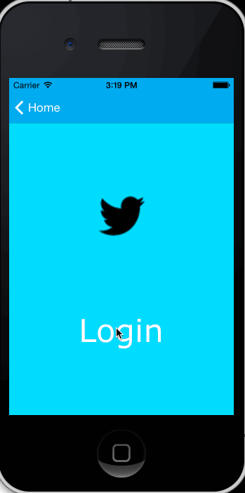

Twitter Client
======

This is an iOS 7 demo app displaying tweets using the Twitter API. It is created as part of [CodePath](http://codepath.com/) course work. (July 1, 2014)

Time spent:
Project 3 -> approximately 12 hours
Project 4 -> 7.5 hours

Features
---------
#### Project 3 Required
- [x] User can sign in using OAuth login flow
- [x] User can view last 20 tweets from their home timeline
- [x] The current signed in user will be persisted across restarts
- [x] In the home timeline, user can view tweet with the user profile picture, username, tweet text, and timestamp.  In other - [x] words, design the custom cell with the proper Auto Layout settings.  You will also need to augment the model classes.
- [x] User can pull to refresh
- [x] User can compose a new tweet by tapping on a compose button.
- [x] User can tap on a tweet to view it, with controls to retweet, favorite, and reply.

#### Project 4 Required
- [x] Hamburger menu
- [x] Profile page contains the user header view
- [x] Profile page contains a section with the users basic stats: # tweets, # following, # followers
- [x] Tapping on a user image should bring up that user's profile page

#### Optional
- No optional tasks completed.

Walkthrough
------------

